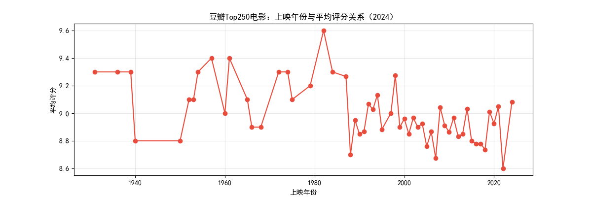
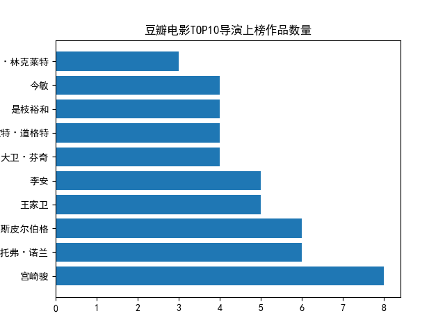

# 🎬 豆瓣Top250电影数据分析
## 分析目标
探索经典电影评分与上映年份的关系

## 关键技术
Python 数据清洗（Pandas）
趋势可视化（Matplotlib）

## 核心发现

1980-2000年老片平均分**9.1**，高于2000年后影片（8.8分）
## 扩展分析：TOP10导演

宫崎骏、诺兰等导演多次上榜，其中：
宫崎骏上榜作品：`8部`  
克里斯托弗·诺兰：`6部`

## 文件说明
'data_analysis.ipynb'：完整分析代码  
'clean_douban.csv'：清洗后数据

数据来源：Kaggle公开数据集，仅用于学习目的
